# Source
Source code: https://github.com/ADeltaX/AudioFlyout\
Release version: https://github.com/ADeltaX/AudioFlyout/releases

# Diffirence in 2 version:
**Phiên bản AudioFlyout:** Sử dụng quyền admin, có thể mở từ bất kì thư mục nào, tắt khi màn hình khoá. Chỉ cần chạy file AudioFlyout.exe

**Phiên bản AudioFlyoutUA:** Không sử dụng quyền admin nhưng sử dụng quyền UI Access. Hiển thị cả trên màn hình khoá. 

# Install AudioFlyoutUA:
Giải nén vào thư mục "Program Files (x86)" (C:\Program Files (x86)\ADeltaX\AudioFlyout)
**Thêm chứng chỉ "Local Machine\Trusted People"**:\
Chuột phải vào AudioFlyoutUA.exe -> Properties -> "Digital Signatures", rồi làm theo hướng dẫn sau:
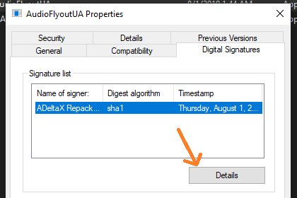\
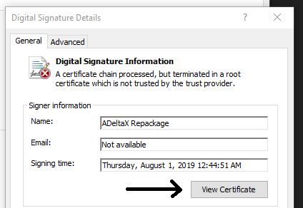\
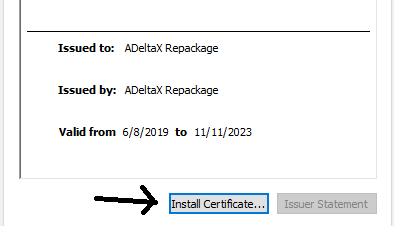\
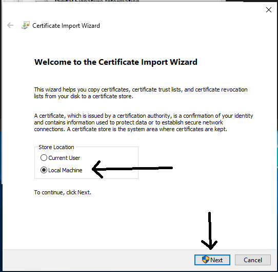\
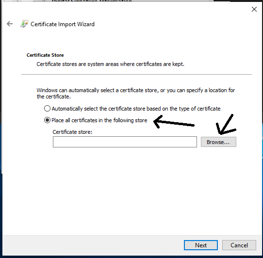\
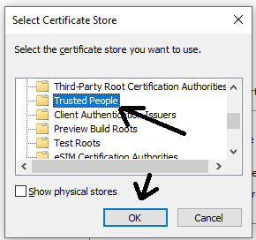\
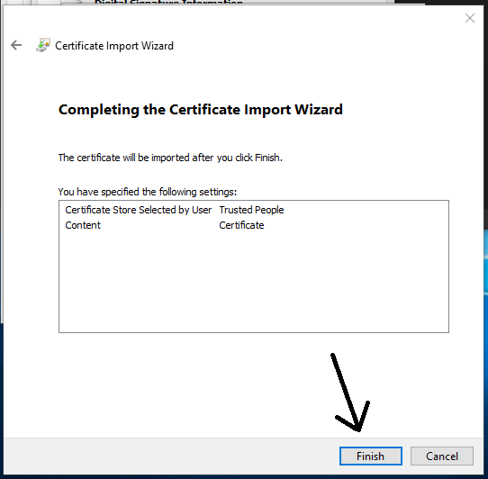\

Sau đó có thể chạy bình thường

## Khởi động AudioFlyoutUA cùng Windows cách 1:
### Tạo task mới trong Task Scheduler
- Mở windows search, tìm kiếm Scheduler Task
- Chuột phải vào nhánh "Task Scheduler Library", chọn New Folder
- Gõ tên, mô tả -> OK
- Mở rộng nhánh "Task Scheduler Library", chọn thư mục vừa tạo, chọn menu Action -> Create Basic Task
- Mục Trigger chọn When the computer starts
- Mục Action chọn start a program, rồi chọn đường dẫn đến AudioFlyoutLauncher.exe
- Next -> Next -> ... -> Finish
- Chọn task vừa chọn, chọn Properties
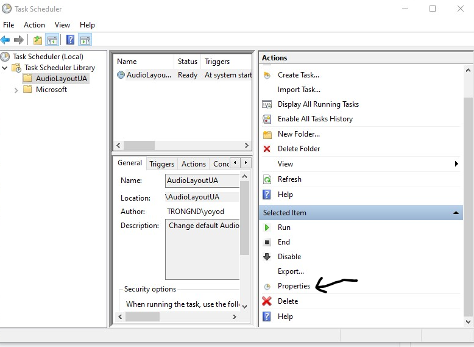
- Chỉnh cài đặt như hình
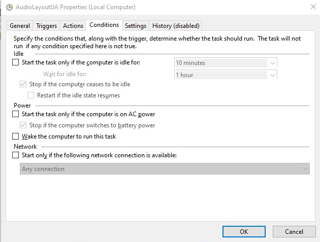
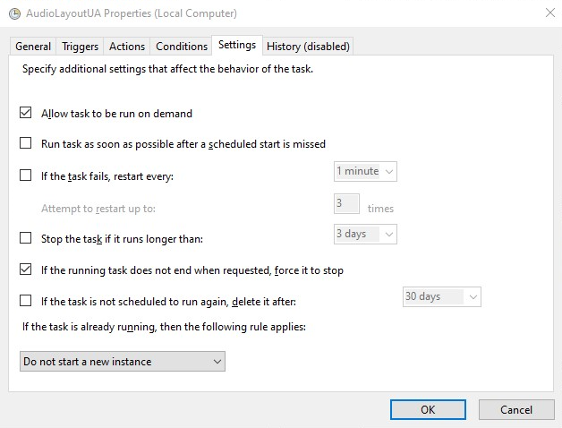
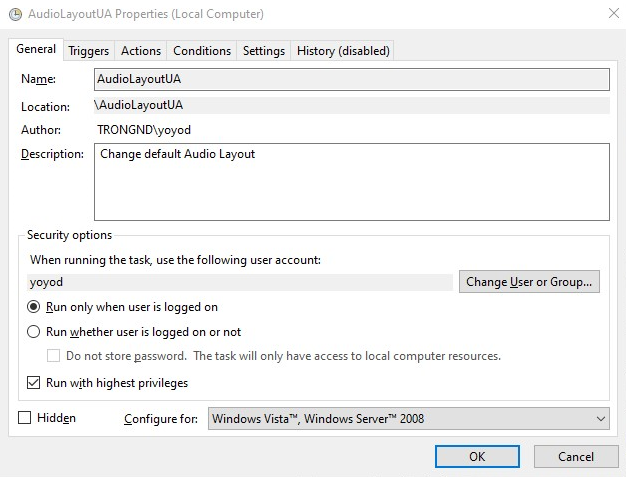

## Khởi động AudioFlyoutUA cùng Windows cách 2:
- Copy shortcut tới thư mục C:\ProgramData\Microsoft\Windows\Start Menu\Programs\StartUp